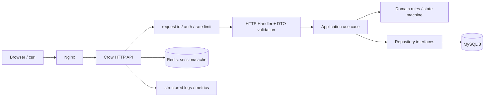
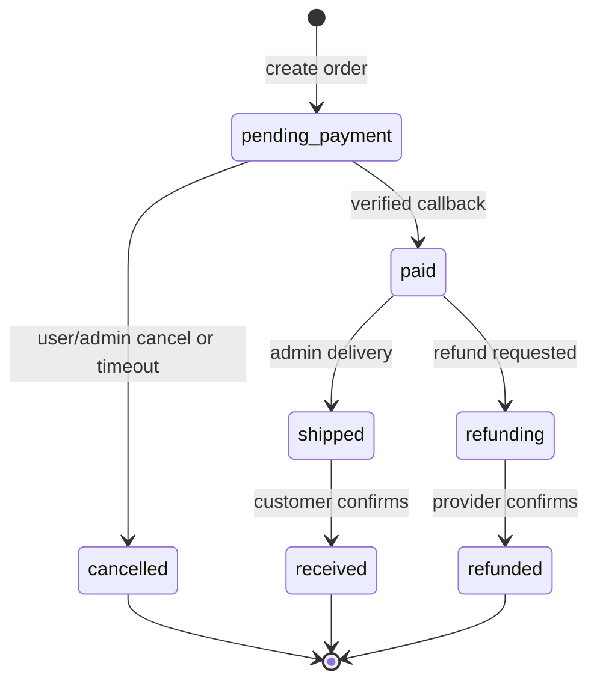

# 架构设计

## 目标

- 单体模块化服务：先让学习成本可控，模块边界清晰后才考虑拆服务。
- REST JSON API：与 PHP 模板渲染分开；静态前端由 Nginx 托管。
- MySQL 是交易事实来源；Redis 仅作会话、缓存、限流，丢失后可重建。
- 任何涉及库存、订单、余额和支付的修改都经数据库事务。

## 模块职责

| 模块 | 负责 | 不负责 |
| --- | --- | --- |
| `http` | 解析请求、校验 DTO、HTTP 状态、Cookie | SQL、价格或订单规则 |
| `application` | 编排 use case、事务边界、授权检查 | Crow 类型、JSON 细节 |
| `domain` | Money、OrderStatus、库存与优惠规则 | 数据库连接、环境变量 |
| `infrastructure` | MySQL SQL、Redis、加密、外部支付客户端 | 决定业务流程 |

## 订单状态机

PHP 的 `order_status`、`shipping_status`、`pay_status` 是多个整数列。C++ 可先保持兼容字段，领域层将它们映射为 `OrderState`；不要让 Handler 到处比较魔法数字。

## 横切规则

- 每个请求生成/透传 `X-Request-Id`，日志、错误体与审计记录均带它。
- Repository 只使用占位符绑定；永不把 `q`、ID 或排序字符串直接拼进 SQL。排序字段使用白名单。
- 事务由 Application 层建立：`PlaceOrder` 一次事务；第三方网络调用在提交后执行，回调再单独事务处理。
- 图片只保存对象存储 key/URL，不存入订单行的可变商品资料；`order_goods` 写入下单时名称、规格、成交价快照。

